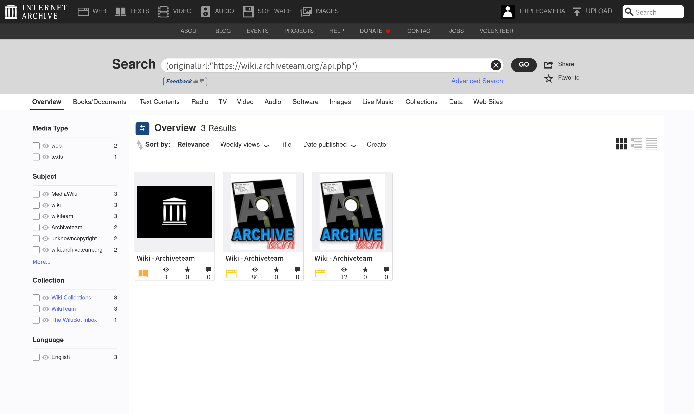
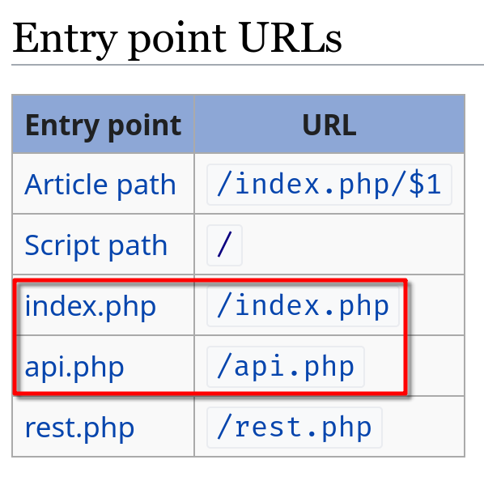

# Tutorial
Welcome! You are probably learning how to archive your favorite wiki using wikiteam3.

Before we get started, to make sure that wikiteam3 suits you, please run through this checklist:

## Beginner's checklist
### Do you have direct shell access to the server?
If you have direct shell access to the server, that makes the backup process much more easier:

 -  If you want to make a private backup **with sensitive data**, just backup both the database and the filesystem.
 -  If you want to make a public backup without sensitive data, run `dumpBackup.php` and share the generated XML to others.

For more information, see [Manual:Backing up a wiki](https://www.mediawiki.org/wiki/Manual:Backing_up_a_wiki).

Wikiteam3, on the other hand, lacks a lot of functionality. For example, compared to `dumpBackup.php`, it cannot backup public logs. So, only use wikiteam3 if you don't have direct shell access.

### Is this wiki recently archived?
It is recommended to look for existing dumps before making one. Usually, if there is a dump within a year, it would be unnecessary to make another one. Exceptions include that the wiki is going to shut down.

Nowadays, most MediaWiki dumps reside in the Internet Archive, with a custom metadata field named `originalurl`, with the value of the `api.php` (or `index.php`) entry point URL (see below). It can be searched with the advanced search syntax `(originalurl:"XXX")`. Asterisks (`*`) are useful for fuzzy matching.

For example, to search the existing dumps of the [ArchiveTeam Wiki](https://wiki.archiveteam.org/), use expression `(originalurl:"https://wiki.archiveteam.org/api.php")` or simply `(originalurl:"*wiki.archiveteam.org*")`.

<figure>
  
  <figcaption>Searching for existing dumps on the Internet Archive</figcaption>
</figure>

### Can wikiteam help you do this favor?
<!-- This paragraph is taken from README.md -->
WikiTeam is always willing to help! For public MediaWiki, there is no need to run wikiteam3 by yourself. You can send an archive request to the [**WikiTeam IRC channel**](https://chat.hackint.org/?join=%23wikiteam) ([logs](https://irclogs.archivete.am/wikiteam)). Please include the archive reason in your request (e.g. the wiki is about to shutdown, a wikidump is needed to migrate to another wikifarm, etc.). An online member will run a [wikibot](https://wikibot.digitaldragon.dev/) job for your request.

If the wiki is private, you would have to run wikiteam3 by yourself:

### Is the wiki powered by MediaWiki?
Is the wiki you want to archive powered by MediaWiki?

Most wikis powered by MediaWiki have a banner at the bottom-right corner. There is also a list of [sites using MediaWiki](https://www.mediawiki.org/wiki/Sites_using_MediaWiki) at MediaWiki.org.

<figure>
  
  <figcaption>The latest "Powered by MediaWiki" banner</figcaption>
</figure>

If the wiki is not powered by MediaWiki, you would have to use dedicated tools for other wikis. For DokuWiki, try [DokuWiki Dumper](https://github.com/saveweb/dokuwiki-dumper); for PukiWiki, try [PukiWiki Dumper](https://github.com/saveweb/pukiwiki-dumper).

## Installing wikiteam3

[Wikiteam3](https://pypi.org/project/wikiteam3/) is a Python package which requires Python 3.9+.

### Installing via uv

It is recommended to install wikiteam3 via [uv](https://docs.astral.sh/uv/).

First, install uv. Then, install wikiteam3 (using the default version of Python interpreter):

```console
$ uv tool install wikiteam3@latest
```

Note that the above command may fail if your default Python interpreter is below Python 3.9. If so, you must specify a higher version of Python interpreter:

```console
$ uv tool install --python <PYTHON> wikiteam3@latest
```

Once installed, the commands `wikiteam3dumpgenerator` and `wikiteam3uploader` are always available.

### Installing via pipx

First, install Python (3.9+) and pipx. Then install wikiteam3.

```console
$ pipx install wikiteam3
```

Once installed, the commands `wikiteam3dumpgenerator` and `wikiteam3uploader` are always available.

### Installing via pip

Tip: There is a detailed tutorial for [**installing packages**](https://packaging.python.org/en/latest/tutorials/installing-packages/) at Python Packaging User Guide. We will only cover the key points here.

First, install Python (3.9+) and pip. Make sure you can run both Python and pip from the command line:

```console
$ python3 --version
$ python3 -m pip --version
```

Then, create a *virtual environment* and activate it, which isolates wikiteam3 and other Python packages.

Finally, install wikiteam3 in the virtual environment:

```console
$ python3 -m pip install wikiteam3
```

If you have installed wikiteam3 correctly, a help message would appear if you run the following command:

```console
$ wikiteam3dumpgenerator --help
```

> [!NOTE]
> If you are a developer, it is recommended to clone wikiteam3 from [GitHub](https://github.com/saveweb/wikiteam3), and install it in *editable mode*.

## Generating a wiki dump
`wikiteam3dumpgenerator` can generate wiki dumps.

```console
$ wikiteam3dumpgenerator [OPTIONS]... [WIKI]
```

There are a lot of options to fill in, including entry point URLs, dump types, and so on.

Here we will use the [ArchiveTeam Wiki](https://wiki.archiveteam.org/) as an example.

### Entry point URLs
Wikiteam3 needs the entry point URLs of `api.php` and `index.php` to archive a wiki. 

The easiest way is to pass the base URL of the wiki you want to backup, and wikiteam3 will try to *guess* the entry point URLs:

```console
$ wikiteam3dumpgenerator [OPTIONS]... https://wiki.archiveteam.org/
```

However, this can sometimes fail. A safer way is to provide the entry point URLs by yourself.

First, navigate to the "Special:Version" special page. You can simply type "Special:Version" in the search box and hit "Enter".

Then, scroll to section "Entry point URLs", and copy the entry points of `api.php` and `index.php`. In our example, the URL of `api.php` is `https://wiki.archiveteam.org/api.php`, and the URL of `index.php` is `https://wiki.archiveteam.org/index.php`. So pass these options:

```console
$ wikiteam3dumpgenerator \
  --api https://wiki.archiveteam.org/api.php \
  --index https://wiki.archiveteam.org/index.php \
  [OPTIONS]...
```

<figure>
  
  <figcaption>Path to <code>api.php</code> and <code>index.php</code> can be found from the "Entry point URLs" section in "Special:Version"</figcaption>
</figure>

### Dump types
*Main article: [Dump Types](dump_types.md)*

Wikiteam3 currently supports three types of dumps: XML dumps, image dumps, and redirect dumps.

For more information, read the "Dump Types" page.

It is recommended to include all of them: `--xml --xmlrevisions --images --redirects`.

### Start dumping
Open the terminal, and `cd` to where you would save your dump. If you installed wikiteam3 in a virtual environment, activate it. Then run wikiteam3 with the arguments you selected.

In our example, here are the arguments:
```console
$ wikiteam3dumpgenerator \
  --api 'https://wiki.archiveteam.org/api.php' \
  --index 'https://wiki.archiveteam.org/index.php' \
  --xml --xmlrevisions \
  --images \
  --redirects
```

Wikiteam3 will create a directory named `<url>-<date>-wikidump`. Note that dumping a small wiki takes hours, dumping a large wiki takes days.

### Checking your dump
Most errors are recorded in `errors.log`.

#### Checking XML dump integrity
How to make sure that the XML dump you just made is valid? The ultimate way is to import it into a running MediaWiki instance, which may be slow and complicated. Here are a few ways to quickly check its integrity:

---

An easy approach is to count the numbers of `<title>`, `<page>`, and `<revision>` tags with `grep`, which is available on almost all Linux distributions.

Run the following command, the results should look like this:

```console
$ grep -E '<title(.*?)>' *.xml -c; grep -E '<page(.*?)>' *.xml -c; grep "</page>" *.xml -c;grep -E '<revision(.*?)>' *.xml -c;grep "</revision>" *.xml -c
580
580
580
5677
5677
```

The first three numbers should be the same and the last two should be the same as each other (the actual numbers may differ). If not, then, your XML dump is corrupted (it is missing one or more `</page>` or `</revision>` end tags).

---

The above method roughly ensures that the XML dump is not damaged. To make sure that the dump applies to the official schema, use `xmllint`:

```console
$ xmllint --schema export-0.11-wikiteam3.xsd path/to/<url>-<date>-history.xml --noout
<url>-<date>-history.xml validates
```

Here we are using `export-0.11-wikiteam3.xsd`, a slightly modified version of the official `export-0.11.xsd` schema. Since `xmllint` cannot access remote schemas, please follow the instructions in the schema to replace the remote schema with a local one.

If it says that `<url>-<date>-history.xml validates`, the XML applies to the schema. If it says that `<url>-<date>-history.xml fails to validate`, the XML is problematic. Please report to us.

---

XML dumps for large wikis have a higher chance to get damaged. If your dump is unfortunately damaged, the solution is to re-run the dump process, until you succeed.

#### Mismatching images
If images appear in the `images_mismatch` directory, this is likely because that the webmaster has enabled server-side compression for images, please contact the webmaster.

#### Other errors
Just read `errors.log` and fix them.

### Upload your dump to the Internet Archive (optional)
See [README](https://github.com/saveweb/wikiteam3/blob/v4-main/README.md#using-wikiteam3uploader).
